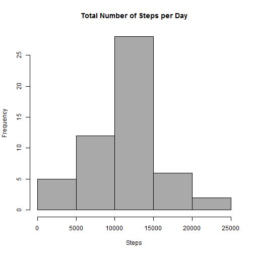
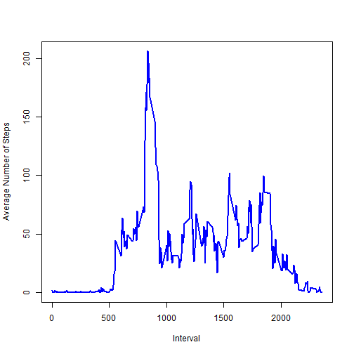
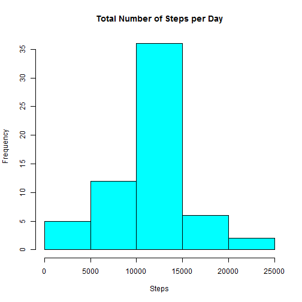
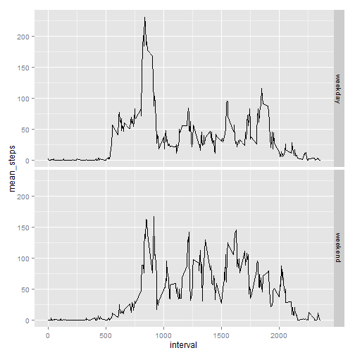

####Summary: This report examines and analyses the data obtained from a personal activity monitoring device and draws conclusions about activity patterns.

**Dataset: "activity.csv"**

**Variables**

* steps: Number of steps taking in a 5-minute interval (missing values are coded as NA)
* date: The date on which the measurement was taken in YYYY-MM-DD format
* interval: Identifier for the 5-minute interval in which measurement was taken


### Loading and preprocessing the data

Data (activity.csv) was downloaded to working directory

```r
setwd("~/GitHub/RepData_PeerAssessment1/activity")
data1 <- read.csv("activity.csv")
```
Examining data and performing basic exploratory analysis

```r
head(data1)
```

```
##   steps       date interval
## 1    NA 2012-10-01        0
## 2    NA 2012-10-01        5
## 3    NA 2012-10-01       10
## 4    NA 2012-10-01       15
## 5    NA 2012-10-01       20
## 6    NA 2012-10-01       25
```

```r
str(data1)
```

```
## 'data.frame':	17568 obs. of  3 variables:
##  $ steps   : int  NA NA NA NA NA NA NA NA NA NA ...
##  $ date    : Factor w/ 61 levels "2012-10-01","2012-10-02",..: 1 1 1 1 1 1 1 1 1 1 ...
##  $ interval: int  0 5 10 15 20 25 30 35 40 45 ...
```

```r
summary(data1)
```

```
##      steps                date          interval     
##  Min.   :  0.00   2012-10-01:  288   Min.   :   0.0  
##  1st Qu.:  0.00   2012-10-02:  288   1st Qu.: 588.8  
##  Median :  0.00   2012-10-03:  288   Median :1177.5  
##  Mean   : 37.38   2012-10-04:  288   Mean   :1177.5  
##  3rd Qu.: 12.00   2012-10-05:  288   3rd Qu.:1766.2  
##  Max.   :806.00   2012-10-06:  288   Max.   :2355.0  
##  NA's   :2304     (Other)   :15840
```
Processing data to convert to date format

```r
data1$date <- as.character(data1$date)
data1$date <- as.Date(data1$date, "%Y-%m-%d")
```

Processing data to get rid of missing values

```r
data2 <- na.omit(data1)
head(data2)
```

```
##     steps       date interval
## 289     0 2012-10-02        0
## 290     0 2012-10-02        5
## 291     0 2012-10-02       10
## 292     0 2012-10-02       15
## 293     0 2012-10-02       20
## 294     0 2012-10-02       25
```
###What is mean total number of steps taken per day? 

(Ignoring the missing values)
The following code uses the dplyr package to group data and then calculates the total number of steps taken per day. 

```r
library(dplyr)
```

```
## 
## Attaching package: 'dplyr'
## 
## The following object is masked from 'package:stats':
## 
##     filter
## 
## The following objects are masked from 'package:base':
## 
##     intersect, setdiff, setequal, union
```

```r
daily <-  group_by(data2, date)
t <- summarise(daily, total1 = sum(steps))
```

Histogram of total number of steps taken each day.


```r
hist(t$total1, main = "Total Number of Steps per Day", xlab = "Steps", col="dark grey")
```

 

Calculating and reporting the mean and median of the total number of steps taken per day.

```r
mean1 <- mean(t$total1)
mean1
```

```
## [1] 10766.19
```

```r
median1 <- median(t$total1)
median1
```

```
## [1] 10765
```
*The mean of total number of steps taken per day is 1.0766189 &times; 10<sup>4</sup>.*

*The median of total number of steps taken per day is 10765.*


###What is the average daily activity pattern?

Making  a time-series plot of the 5-minute interval and the average number of steps taken, averaged across all days.

```r
interval <-  group_by(data2, interval)
i <- summarise(interval, avg = mean(steps))
head(i)
```

```
## Source: local data frame [6 x 2]
## 
##   interval       avg
## 1        0 1.7169811
## 2        5 0.3396226
## 3       10 0.1320755
## 4       15 0.1509434
## 5       20 0.0754717
## 6       25 2.0943396
```

```r
plot(i$interval, i$avg, type = "l", xlab = "Interval", ylab = "Average Number of Steps", col = "blue", lwd = 2)
```

 

Calculating and reporting the interval containing the maximum number of steps.

```r
max_steps = i[(which.max(i$avg)),]$interval
max_steps
```

```
## [1] 835
```
*The interval containg the maximum number of steps is 835.*

###Imputing missing values

Calculating and reporting the total number of missing values in the dataset.


```r
mis_steps <- sum(is.na(data1$steps))
mis_steps
```

```
## [1] 2304
```
*The total number of missing values is 2304.*

Strategy for filling in the missing values in the dataset : use the mean steps for that 5-minute interval.

* Creating a new dataset which is equal to the original dataset but with missing data filled in.
Merge original dataset data1 with i, the dataset averaged and grouped by interval and fill in the missing values with the mean steps for that interval.

```r
data3 <- merge(data1, i)
data3$steps[is.na(data3$steps)] = data3$avg[is.na(data3$steps)]
```
Histogram of total number of steps taken each day.


```r
daily2 <-  group_by(data3, date)
t2 <- summarise(daily2, total2 = sum(steps))
hist(t2$total2, main= "Total Number of Steps per Day", xlab = "Steps", col="cyan")
```

 

Calculating and reporting the mean and median of the total number of steps taken per day.

```r
mean2 <- mean(t2$total2)
mean2
```

```
## [1] 10766.19
```

```r
median2 <- median(t2$total2)
median2
```

```
## [1] 10766.19
```
The mean of total number of steps taken per day is 1.0766189 &times; 10<sup>4</sup>.

The median of total number of steps taken per day is 1.0766189 &times; 10<sup>4</sup>.

Mean and median from first part of assignment:
Mean1: 1.0766189 &times; 10<sup>4</sup>
Median1: 10765

Mean and median after imputing missing values:
Mean2: 1.0766189 &times; 10<sup>4</sup>
Median2: 1.0766189 &times; 10<sup>4</sup>

The mean and median do not differ significantly from the estimates from the first part of the assignment.

Replacing the missing values by mean results in the same mean as previously.
Imputing the missing values results in median being the same as mean.


###Are there differences in activity patterns between weekdays and weekends?

Creating a new factor variable with two levels  - "weekday" and "weekend"

```r
data4 <- mutate(data3, day = weekdays(data3$date), wkday = ifelse(day=="Saturday" | day=="Sunday","weekend","weekday"))
```
Grouping and summarizing data to get average number of steps per interval for weekdays and weekends

```r
by_interval <- group_by(data4, interval, wkday)
mean_steps <- summarise(by_interval, mean_steps = (mean(steps)))
head(mean_steps)
```

```
## Source: local data frame [6 x 3]
## Groups: interval
## 
##   interval   wkday mean_steps
## 1        0 weekday 2.25115304
## 2        0 weekend 0.21462264
## 3        5 weekday 0.44528302
## 4        5 weekend 0.04245283
## 5       10 weekday 0.17316562
## 6       10 weekend 0.01650943
```
Panel Plot for time series of average number steps taken during weekdays and weekends for each interval.


```r
library (ggplot2)
qplot(interval, mean_steps, data=mean_steps, geom="line") + facet_grid(wkday ~ .)
```

 


